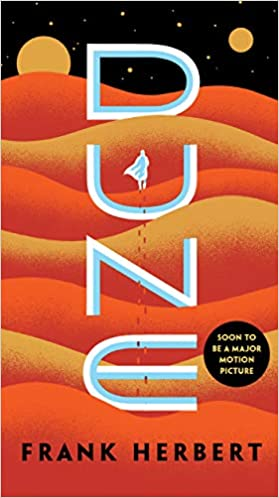

% 2020 Reading List
% Grant Skaggs 
% 20 June 2020

# 2020 Reading List

### Reading Now
* **American Gods,** Neil Gaiman
* **The Selfish Gene,** Richard Dawkins 

### Read So Far

* [The Art of Learning](#the-art-of-learning)
* [Can't Hurt Me](#cant-hurt-me)
* [Zen and the Art of Motercycle Maintenance](#zen-and-the-art-of-motercycle-maintenance)
* [Dune](#dune)
* [Neverwhere](#neverwhere)
* [Travels with Charley in Search of America](#travels-with-charley-in-search-of-america)
* [A Room with a View](#a-room-with-a-view)

### The Art of Learning
*Joshua Waitzkin*

 hello 

### Can't Hurt Me
*David Goggins*

### Zen and the Art of Motercycle Maintenance
*Robert M. Pirsig*

### Dune
*Frank Herbert*

### Neverwhere
*Neil Gaiman*

### Travels with Charley in Search of America
*John Steinbeck*

### A Room with a View
*E. M. Forster*

### Bonus: Spanish Titles
* **Harry Potter y la Piedra Filosofal,** J. K. Rowling
* **Percy Jackson: El Ladron del Rayo,** Rick Riordan
* **Percy Jackson: El Mar de los Monstruos,** Rick Riordan
