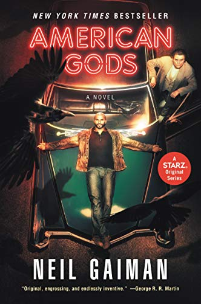

% 2020 Reading List
% Grant Skaggs 
% 20 June 2020

<link rel="stylesheet" href="../css/posts.css">

# 2020 Reading List

### Reading Now
* **The Republic,** Plato
* **Dracula,** Bram Stoker

### Read So Far

* [The Art of Learning](#the-art-of-learning)
* [Can't Hurt Me](#cant-hurt-me)
* [Zen and the Art of Motercycle Maintenance](#zen-and-the-art-of-motercycle-maintenance)
* [Dune](#dune)
* [Neverwhere](#neverwhere)
* [Travels with Charley in Search of America](#travels-with-charley-in-search-of-america)
* [A Room with a View](#a-room-with-a-view)
* [American Gods](#american-gods)
* [The Selfish Gene](#the-selfish-gene)

 

### The Art of Learning

*Josh Waitzkin*

Date read: March 2020  
Strength of recomendation: **9** / 10   
<a href="https://www.amazon.com/Art-Learning-Journey-Optimal-Performance/dp/0743277465">Amazon page</a>

Waitzkin provides a wealth of wisdom in the space of high performance psychology. My second time reading this book. 

### Can't Hurt Me

*David Goggins*

Date read: March 2020  
Strength of recomendation: **9** / 10   
<a href="https://www.amazon.com/Cant-Hurt-Me-Master-Your/dp/1544512287">Amazon page</a>

The only audiobook I've ever listened to a second time as soon as I finished the first. Goggins overcame child abuse, poverty, and small-town racism to go on to lose over a 100 lbs and become a celebrated Navy SEAL and ultramarathon runner. Absolutely inspirational.

### Zen and the Art of Motercycle Maintenance

*Robert M. Pirsig*

Date read: April 2020  
Strength of recomendation: **10** / 10   
<a href="https://www.amazon.com/Zen-Art-Motorcycle-Maintenance-Inquiry-ebook/dp/B0026772N8">Amazon page</a>

A philosophical dive into the intersection of rationality, intuition, and values. This work greatly shaped the way I see Eastern and Western thought.

### Dune

*Frank Herbert*

Date read: April 2020  
Strength of recomendation: **9** / 10   
<a href="https://www.amazon.com/Dune-Frank-Herbert/dp/0441172717">Amazon page</a>

A masterpiece of world-building and story. I found myself listening to the audiobook for hours into the night, lost in Herbert's fiction.

### Neverwhere

*Neil Gaiman*

Date read: May 2020  
Strength of recomendation: **7** / 10   
<a href="https://www.amazon.com/Neverwhere-Novel-Neil-Gaiman-ebook/dp/B000FC130E">Amazon page</a>

A fun book, though unlikely to be remembered as Gaiman's greatest work. 

### Travels with Charley in Search of America

*John Steinbeck*

Date read: June 2020  
Strength of recomendation: **7** / 10   
<a href="https://www.amazon.com/Travels-Charley-Search-America-Steinbeck/dp/0140053204">Amazon page</a>

Steinbeck's road trip across America with his French poodle Charley makes for a charming and enjoyable read.

**Notes:** 

> So I drove up the mountain and found a dairy, bought some milk, and asked permission to camp under an apple tree. The dairy man had a Ph.D. in mathematics, and he must have had some training in philosophy. He liked what he was doing and he didn't want to be somewhere else - one of the very few content people I met in my whole journey.

I'd like to imagine this figure as a living specimen of the archetypal old wise man, contented to live a life of simplicity.

> He put my sins in a new perspective. Whereas they had been small and mean and nasty and best forgotten, this minister gave them some size and bloom and dignity... I wasn't a naughty child but a first rate sinner.   ...   All across the country I went to church on Sundays, a different denomination every week, but nowhere did I find the quality of that Vermont preacher. He forged a religion designed to last, not predigested obsolescence.

There’s something deeply unsatisfying about the idea that one’s sins are of little or no consequence. To instead recognize the human propensity to do real terrible evil gives meaning to one’s actions, and simultaneously makes indisputable not only one’s capacity, but one’s necessity, to do good in the world.

> Like most Americans I am no lover of cops, and the consistent investigation of city forces for bribery, brutality, and a long picturesque list of malfeasances is not designed to reassure me.

Reading this in a book published in 1962 sobered me to what difficult, fundamental, and longlasting problems police brutality and corruption are, especially in light of the now recent murder of George Floyd. 

### A Room with a View

*E. M. Forster*

Date read: June 2020  
Strength of recomendation: **6** / 10   
<a href="https://www.amazon.com/Room-View-Dover-Thrift-Editions/dp/0486284670">Amazon page</a>

Although I appreciated Forster's beautiful prose and the positive spirit of his ultimately feminist message, I couldn't help but feel the central romance of this novel has become, at least for a modern reader, predictable almost to the point of cliche.

**Notes:**

> There is only one perfect view—the view of the sky straight over our heads, and that all these views on earth are but bungled copies of it.

Above our heads is the heavenly ideal. It is that which we look up to with our aspirations and good intentions, that which we try to bring about in this world.

> Men fall into two classes—those who forget views and those who remember them, even in small rooms.

Taken with the previous quote, perhaps Forster is suggesting that men either care for seeing and doing what is right in the world or they reject and forget these ideals altogether.

> “Life” wrote a friend of mine, “is a public performance on the violin, in which you must learn the instrument as you go along.”

### American Gods 

*Neil Gaiman*

Date read: July 2020  
Strength of recomendation: **8** / 10   
<a href="https://www.amazon.com/American-Gods-Neil-Gaiman/dp/0380973650">Amazon page</a>

A thrilling novel. Gaiman employs gods old and new, providing deep insight into America and the nature of human belief. 

### The Selfish Gene

*Richard Dawkins*

Date read: July 2020  
Strength of recomendation: **9** / 10   
<a href="https://www.amazon.com/Selfish-Gene-Anniversary-Landmark-Paperback/dp/B0722G5V92/ref=sr_1_3?dchild=1&keywords=The+Selfish+Gene&qid=1595179526&sr=8-3">Amazon page</a>

Dawkins explores economic and evolutionary theory to explain the interplay of selfishness and altruism in nature. Worth reading alone for the incredible descriptions of regicidal insect colonies, game-theoretic fig trees, and the first ever use of the word *meme.* 

**Notes:**

In one sense, Darwin’s “survival of the fittest” may be rephrased as “survival of the stable.” Applied to the chaotic origins of life and DNA, this modification rings particularly true. In these primeval conditions, the simple replicators which preceded modern genetic material did well if they possessed three qualities. First *longevity,* they did not easily breakdown. Second *fecundity,* they replicated quickly. And third *accuracy,* they replicated with minimal error. 

Dawkins defines a gene as: *any portion of chromosomal material that potentially lasts for enough generations to serve as a unit of natural selection.*

Dawkins defines an Evolutionary Stable Strategy or ESS as: *a strategy which, if most members of a species adopt it, cannot be beaten by another strategy.* Such a strategy may very well be encoded genetically and may therefore be subject to the same Darwinian analysis as any other phenotype. 

Consider for example, the practice of cuckoo birds to parasite the nests of other species. This qualifies as an ESS since any cuckoo born without genetic encoding to employ this strategy would be at a certain disadvantage and ultimately its genes would not prevail over the majority. 

In biological terms, the fundamental difference between males and females is that male gametes are smaller and more numerous than the gametes of females. The consequences of this asymmetry are many and profound. One is that males may be more likely to abandon their children in favor of pursuing other mates. To combat such behavior, females of several species evolved to either a) play coy, forcing males to invest more time and energy in the process of mate-finding or b) choose to mate with the strongest, most environmentally fit males regardless his potentially improbable honesty. 

Naked mole rats organize themselves similarly to social insects like bees and ants. In fact, in any given mole rate colony only one female (the queen) breeds, and the vast majority of work is done by sterile individuals called workers.

Some species of ants wage war on and kidnap the eggs of other ant colonies. Once hatched these eggs are kept as the unwitting slaves of the aggressor ants. Even as they mature into adult worker ants, these slaves remain unaware that they serve a foreign species.

Dawkins defines memes as: *units of cultural transmission.* These are the new replicators. The ideas, songs, fashions, catch-phrases which abound in the evolving soup of human culture.

We can apply the same analysis of longevity, fecundity, and replication accuracy to memes. Additionally, we note that memes which do well are often psychologically appealing. 

The fundamental principle necessary for memes to existence in a population is the capability of individuals to mimic one-another. In fact, the songs which live and mutate within populations of some bird species qualify as memes.

A parasite may transport its genes via the same vehicle as its host, i.e. through the host’s gametes in sexual reproduction. If this is the case, then the parasite has everything to gain by helping its host to survive and procreate, and over evolutionary time will cease to be a parasite at all.

In the ant species *Bothriomyrmex regicides* and *B. decapitans,* the queen sneaks into a foreign colony, assassinates via decapitation the rival queen, and then presides over the workers who unsuspectingly tend to her eggs and larvae. Over time her children will outnumber and replace the workers of the previous species. Some will fly to other colonies and repeat the regicidal ritual.

Fireflies attract their mates by flashing particular sequences of lights. The genus *Photuris* has evolved to mimic the flashing pattern of genus *Photinus.* In doing so, the females of the former attract and then devour the males of the latter.
 

### Bonus: Spanish Titles
* **Harry Potter y la Piedra Filosofal,** J. K. Rowling
* **Percy Jackson: El Ladron del Rayo,** Rick Riordan
* **Percy Jackson: El Mar de los Monstruos,** Rick Riordan
