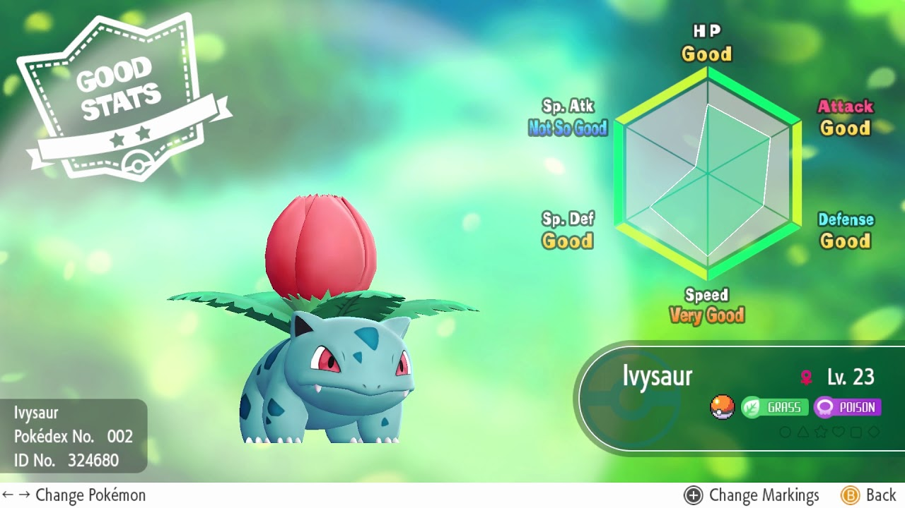

% Some Practical Thoughts on Iroh's Big Questions
% Grant Skaggs 
% 25 August 2020

# Some Practical Thoughts on Iroh's Big Questions

 
`I’m a killer, girl, I'm sorry, but I can't change —Polo G` 

Some people are killers.

Others aren’t.

Western culture places immense importance on staying true to oneself. And for good reason. The alternative is definitionally a false life, out of harmony with one’s own values and dispositions.

Yet the journey to understanding one’s own identity and character doesn’t always feel easy or obvious. In the case of Prince Zuko, it was painful and difficult and resulted in my favorite character arc in Avatar:

 
`It’s time for you to look inward and begin asking yourself the big questions:`   `Who are you?`   `And what do **you** want?`

My intent, then, in this post is not to give a definitive answer to that omnipresent question: *Who am I?* Instead, I’d like to share a psychological framework I’ve found to provide some practical, if incomplete, answers. 

Recorded at the University of Toronto and since [posted on YouTube](https://www.youtube.com/watch?v=kYYJlNbV1OM&list=PL22J3VaeABQApSdW8X71Ihe34eKN6XhCi), Jordan Peterson’s *Personality and its Transformations* course first dives deep into the great psychoanalytic thinkers like Freud, Jung, and Rogers. Then Peterson examines The Big Five Traits. These are the most widely accepted personality theory in modern psychology and, for me at least, represent a paradigm shift in how I view myself and others. 

Easily remembered with the acronym OCEAN, the five traits are Openness, Conscientiousness, Extraversion, Agreeableness, and Neuroticism.

The theory blew my mind for a couple reasons:

The traits finally provided a satisfying means of evaluating my own personality. I immediately identified myself very high in C and A. 
I began to admire traits like openness others had in quantities that I didn’t. Consequently, I had motivation to invest time and energy cultivating curiosity and creativity.
Suddenly I have the giddy experience of seeing the world abstracted in my mind as billions of 5-dimensional Pokemon

*For a complete explanation of Big Five framework checkout [this article](https://www.simplypsychology.org/big-five-personality.html) by Simply Psychology.*
