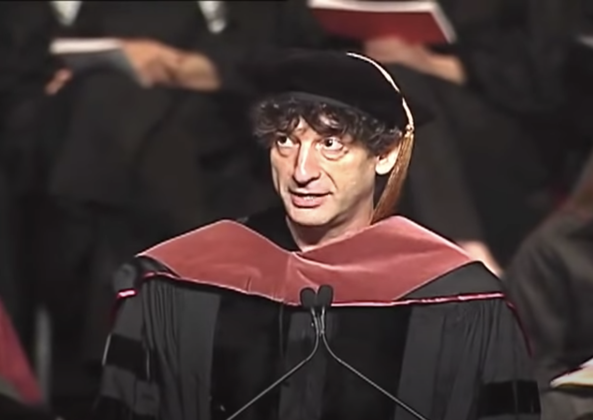
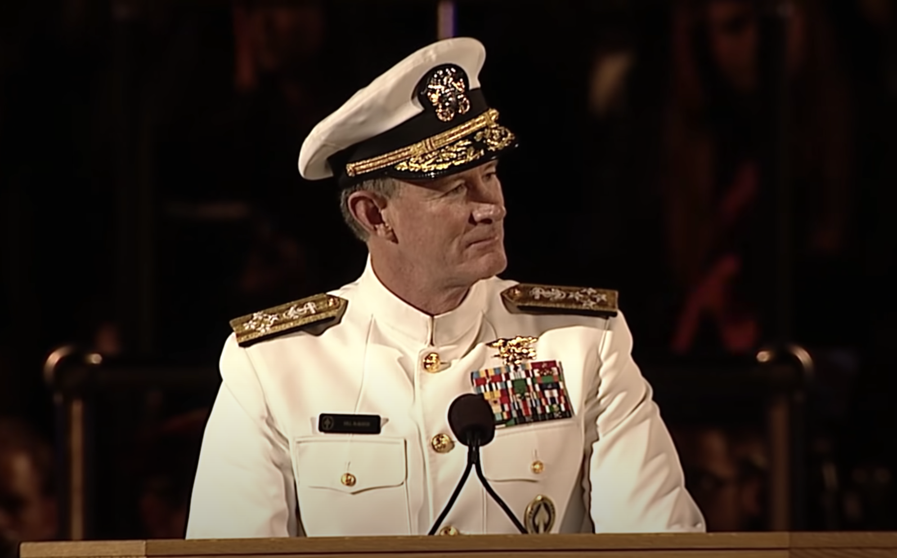

% Commencement Speeches 
% Grant Skaggs 
% 5 July 2020

<link rel="stylesheet" href="../css/posts.css">

# My Top 5 Favorite Commencement Speeches 

 

### David Foster Wallace's "This is Water"

*Delivered to the 2005 graduating class of Kenyon College*

<a href="https://www.youtube.com/watch?v=8CrOL-ydFMI">Youtube</a> / 
<a href="https://jamesclear.com/great-speeches/this-is-water-by-david-foster-wallace">Transcript</a>

**Notes:**

 

### Neil Gaiman's "Make Good Art"
 
*Delivered to the 2012 graduating class of the University of the Arts*

<a href="https://www.youtube.com/watch?v=ikAb-NYkseI">Youtube</a> /
<a href="https://jamesclear.com/great-speeches/make-good-art-by-neil-gaiman">Transcript</a>

> I learned to write by writing. I tended to do anything as long as it felt like an adventure, and to stop when it felt like work, which meant that life did not feel like work. 

**Notes:** 

Gaiman didn't go to University. He felt the need to write and put himself out into the world.

He didn't have a career plan. Just a list of things he wanted to do: "to write an adult novel, a children's book, a comic, a movie, record an audiobook, write an episode of Doctor Who…"

Gaiman gives the graduating class several pieces of advice:

1. Being young and knowing what is possible or impossible makes doing the impossible that much easier.
1. If you have an idea of what you were meant to do, then just do it. Gaiman conceptualizes his dream of being a great author as a distant mountain. At a crossroads, he'd ask himself which path would take him toward and which would take him away from that mountain.
1. You will have to deal with the painful problems of failure. To Gaiman, the life of a freelance artist "is sometimes like putting messages in bottles, on a desert island, and hoping that someone will find one of your bottles and open it and read it, and put something in a bottle that will wash its way back to you: appreciation, or a commission, or money, or love."
1. Make mistakes. They indicate that you're doing something worth doing. And whatever misfortune presents itself in your life, just remember to make good art.
1. Furthermore, make *your* art. Make the art only you can make. If you start feeling like you're walking naked down the street, then you're on the right track.
1. As a freelancer you get hired however you can. You keep you job by a) doing good work, b) being easy to get along with, and c) getting your work in on time. According to Gaiman, if you think about it, you really only need to achieve any two of these three.
1. Enjoy the ride. Don't worry too much.

Finally, Gaiman concludes that if you don't know what you're doing, then pretend you are someone who is wise or competenet. Then just behave how that person would.

 

### 

*Delivered to the*

<a href="">Youtube</a>

**Notes:**

 

### 

*Delivered to the*

<a href="">Youtube</a>

**Notes:**

 

### Admiral William H. McRaven's "Make Your Bed"

*Delivered to the 2014 graduating class of the University of Texas at Austin*

<a href="https://www.youtube.com/watch?v=pxBQLFLei70">Youtube</a> /
<a href="https://jamesclear.com/great-speeches/make-your-bed-by-admiral-william-h-mcraven">Transcript</a>

**Notes:**

UT’s slogan is “What starts here changes the world.” McRaven points out that the effects of even small, simple decisions propagate across time and generations to have huge consequences. Indeed, this class of 8000 graduates has in their collective actions the potential to truly improve the world.

He draws upon his experience in Navy SEAL training, giving the graduating class some advice for their coming journeys:

1. Make your bed. This habit reminds you that excellence in the little things of life matters. The made bed provides a small source of pride in the morning. And besides, no matter how terrible your day, at least you’ll come home to the encouragement of a bed you made for yourself.
1. You’ll need teamwork to change the world.
1. Measure people not by their appearance, but instead by their character.
1. Sometimes your best effort won’t prevent you from failing.
1. In fact, you will likely have to fail often and should not be afraid of failure.
1. Sometimes innovation requires courage in the face of risk and adversity.
1. Stand your ground to the bullies.
1. In the darkest moments, show your very best.
1. Hope, given to others in times of struggle, is an immensely powerful gift.
1. Never give up.

